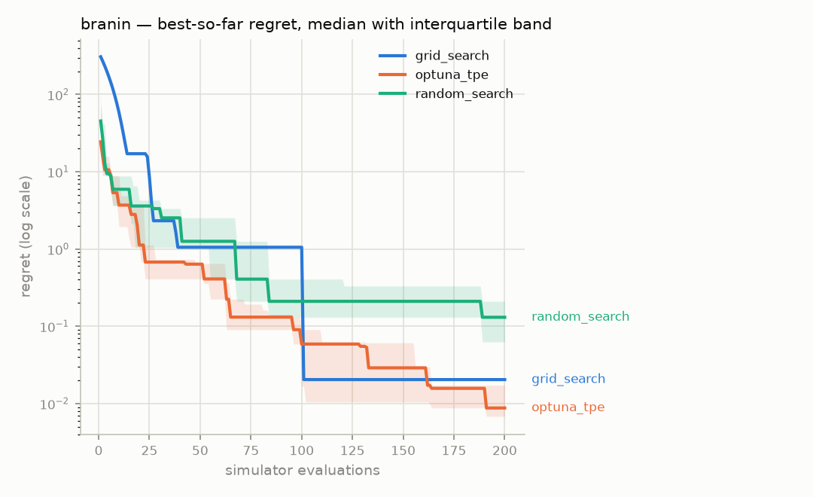
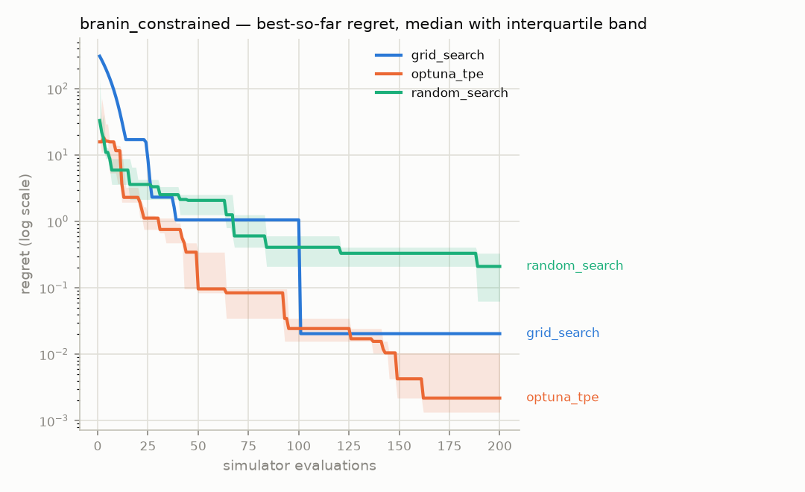
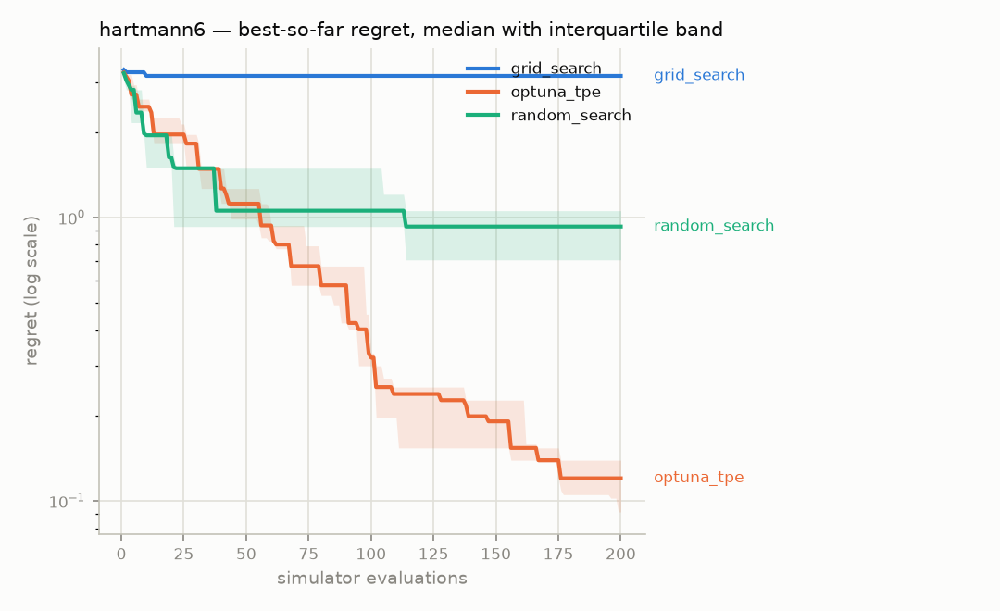
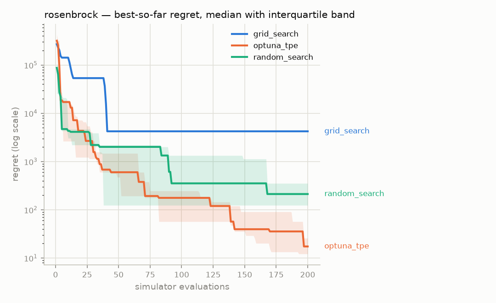

# Ablation report — `phase2-main`

Generated 2026-08-05 15:49 UTC, from 60 runs in the `episodes` table.

- Strategies: grid_search, optuna_tpe, random_search
- Benchmarks: branin, branin_constrained, hartmann6, rosenbrock
- Seeds per cell: 5
- Evaluation budget: 200 simulator calls per run

Every strategy receives the same benchmarks, the same seeds and the same
number of simulator calls. Scores are **regret** — distance from the
benchmark's known global optimum — computed over feasible results only.

## Headline — mean ± standard deviation of final regret

Lower is better.

| Strategy | branin | branin_constrained | hartmann6 | rosenbrock |
|---|---|---|---|---|
| grid_search | 0.02041 ± 0 | 0.02041 ± 0 | 3.157 ± 0 | 4226 ± 0 |
| optuna_tpe | 0.01884 ± 0.024 | 0.009169 ± 0.013 | 0.1519 ± 0.1 | 28.94 ± 33 |
| random_search | 0.1528 ± 0.12 | 0.2082 ± 0.16 | 0.8659 ± 0.42 | 547.3 ± 8.3e+02 |

Grid search shows a standard deviation of exactly zero because it does not
consume the seed: its points are fixed by the parameter space and the budget,
so every seed produces the identical run. That is a property of the strategy,
not a suspiciously clean measurement.

## Budget actually used, and why each run stopped

| Strategy | Benchmark | Mean evaluations | Terminated |
|---|---|---|---|
| grid_search | branin | 196 | EXHAUSTED |
| grid_search | branin_constrained | 196 | EXHAUSTED |
| grid_search | hartmann6 | 64 | EXHAUSTED |
| grid_search | rosenbrock | 81 | EXHAUSTED |
| optuna_tpe | branin | 200 | BUDGET |
| optuna_tpe | branin_constrained | 200 | BUDGET |
| optuna_tpe | hartmann6 | 200 | BUDGET |
| optuna_tpe | rosenbrock | 200 | BUDGET |
| random_search | branin | 200 | BUDGET |
| random_search | branin_constrained | 200 | BUDGET |
| random_search | hartmann6 | 200 | BUDGET |
| random_search | rosenbrock | 200 | BUDGET |

`EXHAUSTED` means the strategy ran out of things to propose before it ran
out of budget — grid search covers its whole grid and stops. `BUDGET`
means the full allowance of simulator calls was spent.

## Is the difference real?

| Benchmark | A | B | median A | median B | U | p (two-sided) | |
|---|---|---|---|---|---|---|---|
| branin | grid_search | optuna_tpe | 0.02041 | 0.008756 | 20 | 0.1188 | † |
| branin | grid_search | random_search | 0.02041 | 0.1307 | 0 | 0.0075 | † |
| branin | optuna_tpe | random_search | 0.008756 | 0.1307 | 1 | 0.0159 |  |
| branin_constrained | grid_search | optuna_tpe | 0.02041 | 0.002187 | 20 | 0.1188 | † |
| branin_constrained | grid_search | random_search | 0.02041 | 0.2102 | 0 | 0.0075 | † |
| branin_constrained | optuna_tpe | random_search | 0.002187 | 0.2102 | 1 | 0.0159 |  |
| hartmann6 | grid_search | optuna_tpe | 3.157 | 0.1201 | 25 | 0.0075 | † |
| hartmann6 | grid_search | random_search | 3.157 | 0.9283 | 25 | 0.0075 | † |
| hartmann6 | optuna_tpe | random_search | 0.1201 | 0.9283 | 1 | 0.0159 |  |
| rosenbrock | grid_search | optuna_tpe | 4226 | 17.37 | 25 | 0.0075 | † |
| rosenbrock | grid_search | random_search | 4226 | 211.9 | 25 | 0.0075 | † |
| rosenbrock | optuna_tpe | random_search | 17.37 | 211.9 | 1 | 0.0159 |  |

† One side of this comparison is deterministic: every seed produced an
identical run. Those are not independent observations, they are one
observation recorded once per seed, so the p-value overstates the evidence —
the test cannot tell replication from repetition. Read these rows as a
comparison of medians and disregard the p-value.

## Seed noise floor

Measured by running each baseline over many more seeds than the protocol
requires, then repeatedly drawing 5 of them at random and taking the
mean. The spread column is how far apart two 5-seed means can be when
nothing differs but the seeds — **a gap smaller than that proves nothing.**

| Strategy | Benchmark | Seeds run | Mean regret | 90% interval of a 5-seed mean | Spread |
|---|---|---|---|---|---|
| optuna_tpe | branin | 20 | 0.008445 | [0.002874, 0.01845] | 0.01557 |
| optuna_tpe | branin_constrained | 20 | 0.007458 | [0.002834, 0.01442] | 0.01159 |
| optuna_tpe | hartmann6 | 20 | 0.1558 | [0.08585, 0.2408] | 0.155 |
| optuna_tpe | rosenbrock | 20 | 25.44 | [9.209, 47.84] | 38.63 |
| random_search | branin | 20 | 0.1661 | [0.06337, 0.3314] | 0.268 |
| random_search | branin_constrained | 20 | 0.2844 | [0.1225, 0.4882] | 0.3657 |
| random_search | hartmann6 | 20 | 0.92 | [0.7212, 1.133] | 0.412 |
| random_search | rosenbrock | 20 | 769.1 | [282.5, 1280] | 997.2 |

## Convergence

### branin

### branin_constrained

### hartmann6

### rosenbrock

Regret is clamped at zero and plotted on a log axis; values below 1e-06
are drawn at that floor.

## Every run

The raw numbers behind every cell above, so the table can be checked
rather than trusted.

| Strategy | Benchmark | Seed | Evaluations | Best feasible | Regret | Terminated |
|---|---|---|---|---|---|---|
| grid_search | branin | 1 | 196 | 0.418293 | 0.0204063 | EXHAUSTED |
| grid_search | branin | 2 | 196 | 0.418293 | 0.0204063 | EXHAUSTED |
| grid_search | branin | 3 | 196 | 0.418293 | 0.0204063 | EXHAUSTED |
| grid_search | branin | 4 | 196 | 0.418293 | 0.0204063 | EXHAUSTED |
| grid_search | branin | 5 | 196 | 0.418293 | 0.0204063 | EXHAUSTED |
| grid_search | branin_constrained | 1 | 196 | 0.418293 | 0.0204063 | EXHAUSTED |
| grid_search | branin_constrained | 2 | 196 | 0.418293 | 0.0204063 | EXHAUSTED |
| grid_search | branin_constrained | 3 | 196 | 0.418293 | 0.0204063 | EXHAUSTED |
| grid_search | branin_constrained | 4 | 196 | 0.418293 | 0.0204063 | EXHAUSTED |
| grid_search | branin_constrained | 5 | 196 | 0.418293 | 0.0204063 | EXHAUSTED |
| grid_search | hartmann6 | 1 | 64 | -0.165567 | 3.1568 | EXHAUSTED |
| grid_search | hartmann6 | 2 | 64 | -0.165567 | 3.1568 | EXHAUSTED |
| grid_search | hartmann6 | 3 | 64 | -0.165567 | 3.1568 | EXHAUSTED |
| grid_search | hartmann6 | 4 | 64 | -0.165567 | 3.1568 | EXHAUSTED |
| grid_search | hartmann6 | 5 | 64 | -0.165567 | 3.1568 | EXHAUSTED |
| grid_search | rosenbrock | 1 | 81 | 4225.5 | 4225.5 | EXHAUSTED |
| grid_search | rosenbrock | 2 | 81 | 4225.5 | 4225.5 | EXHAUSTED |
| grid_search | rosenbrock | 3 | 81 | 4225.5 | 4225.5 | EXHAUSTED |
| grid_search | rosenbrock | 4 | 81 | 4225.5 | 4225.5 | EXHAUSTED |
| grid_search | rosenbrock | 5 | 81 | 4225.5 | 4225.5 | EXHAUSTED |
| optuna_tpe | branin | 1 | 200 | 0.398337 | 0.000449581 | BUDGET |
| optuna_tpe | branin | 2 | 200 | 0.406643 | 0.00875595 | BUDGET |
| optuna_tpe | branin | 3 | 200 | 0.415118 | 0.0172314 | BUDGET |
| optuna_tpe | branin | 4 | 200 | 0.40469 | 0.00680303 | BUDGET |
| optuna_tpe | branin | 5 | 200 | 0.458871 | 0.0609837 | BUDGET |
| optuna_tpe | branin_constrained | 1 | 200 | 0.428436 | 0.0305491 | BUDGET |
| optuna_tpe | branin_constrained | 2 | 200 | 0.408367 | 0.0104802 | BUDGET |
| optuna_tpe | branin_constrained | 3 | 200 | 0.399224 | 0.00133719 | BUDGET |
| optuna_tpe | branin_constrained | 4 | 200 | 0.39918 | 0.00129278 | BUDGET |
| optuna_tpe | branin_constrained | 5 | 200 | 0.400074 | 0.00218746 | BUDGET |
| optuna_tpe | hartmann6 | 1 | 200 | -3.23105 | 0.0913231 | BUDGET |
| optuna_tpe | hartmann6 | 2 | 200 | -3.18329 | 0.139083 | BUDGET |
| optuna_tpe | hartmann6 | 3 | 200 | -3.20229 | 0.120078 | BUDGET |
| optuna_tpe | hartmann6 | 4 | 200 | -3.2428 | 0.0795724 | BUDGET |
| optuna_tpe | hartmann6 | 5 | 200 | -2.9927 | 0.329672 | BUDGET |
| optuna_tpe | rosenbrock | 1 | 200 | 25.7597 | 25.7597 | BUDGET |
| optuna_tpe | rosenbrock | 2 | 200 | 3.2356 | 3.2356 | BUDGET |
| optuna_tpe | rosenbrock | 3 | 200 | 12.182 | 12.182 | BUDGET |
| optuna_tpe | rosenbrock | 4 | 200 | 17.3745 | 17.3745 | BUDGET |
| optuna_tpe | rosenbrock | 5 | 200 | 86.1447 | 86.1447 | BUDGET |
| random_search | branin | 1 | 200 | 0.460646 | 0.0627594 | BUDGET |
| random_search | branin | 2 | 200 | 0.728889 | 0.331002 | BUDGET |
| random_search | branin | 3 | 200 | 0.608084 | 0.210197 | BUDGET |
| random_search | branin | 4 | 200 | 0.427398 | 0.0295109 | BUDGET |
| random_search | branin | 5 | 200 | 0.528581 | 0.130694 | BUDGET |
| random_search | branin_constrained | 1 | 200 | 0.460646 | 0.0627594 | BUDGET |
| random_search | branin_constrained | 2 | 200 | 0.728889 | 0.331002 | BUDGET |
| random_search | branin_constrained | 3 | 200 | 0.608084 | 0.210197 | BUDGET |
| random_search | branin_constrained | 4 | 200 | 0.427398 | 0.0295109 | BUDGET |
| random_search | branin_constrained | 5 | 200 | 0.805606 | 0.407719 | BUDGET |
| random_search | hartmann6 | 1 | 200 | -1.93781 | 1.38456 | BUDGET |
| random_search | hartmann6 | 2 | 200 | -2.61452 | 0.707852 | BUDGET |
| random_search | hartmann6 | 3 | 200 | -3.06914 | 0.25323 | BUDGET |
| random_search | hartmann6 | 4 | 200 | -2.26684 | 1.05553 | BUDGET |
| random_search | hartmann6 | 5 | 200 | -2.39411 | 0.928264 | BUDGET |
| random_search | rosenbrock | 1 | 200 | 2010.84 | 2010.84 | BUDGET |
| random_search | rosenbrock | 2 | 200 | 211.892 | 211.892 | BUDGET |
| random_search | rosenbrock | 3 | 200 | 352.658 | 352.658 | BUDGET |
| random_search | rosenbrock | 4 | 200 | 37.142 | 37.142 | BUDGET |
| random_search | rosenbrock | 5 | 200 | 123.88 | 123.88 | BUDGET |
