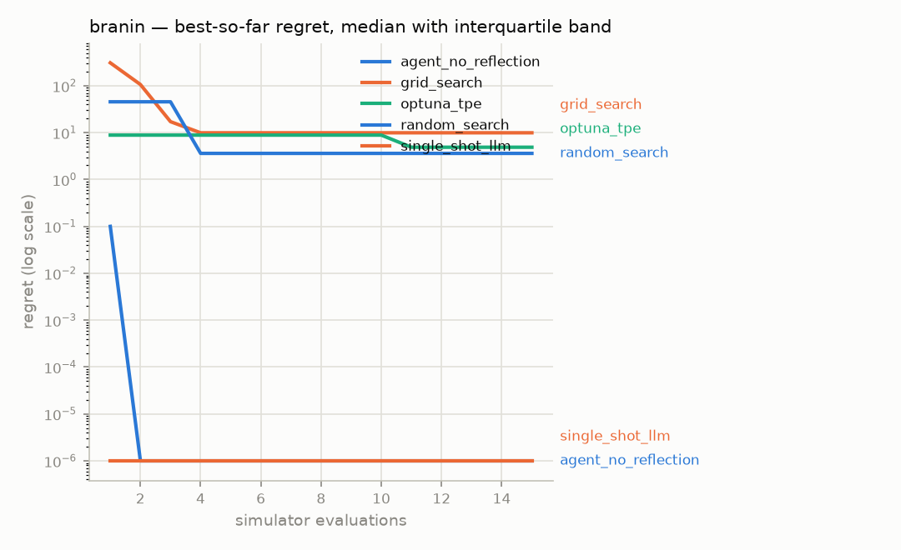

# Ablation report — `phase3-llm`

Generated 2026-08-05 20:58 UTC, from 5 runs in the `episodes` table.

- Strategies: agent_no_reflection, grid_search, optuna_tpe, random_search, single_shot_llm
- Benchmarks: branin
- Seeds per cell: 1
- Evaluation budget: 15 simulator calls per run

Every strategy receives the same benchmarks, the same seeds and the same
number of simulator calls. Scores are **regret** — distance from the
benchmark's known global optimum — computed over feasible results only.

## Headline — mean ± standard deviation of final regret

Lower is better.

| Strategy | branin |
|---|---|
| agent_no_reflection | 3.578e-07 (n=1) |
| grid_search | 9.91 (n=1) |
| optuna_tpe | 4.876 (n=1) |
| random_search | 3.604 (n=1) |
| single_shot_llm | 3.58e-07 (n=1) |

`(n=1)` marks a cell with a single seed: a mean exists, a sample standard
deviation does not. Those cells show what happened once and support no
claim about what happens on average.

## Budget actually used, and why each run stopped

| Strategy | Benchmark | Mean evaluations | Terminated |
|---|---|---|---|
| agent_no_reflection | branin | 15 | BUDGET |
| grid_search | branin | 9 | EXHAUSTED |
| optuna_tpe | branin | 15 | BUDGET |
| random_search | branin | 15 | BUDGET |
| single_shot_llm | branin | 15 | BUDGET |

`EXHAUSTED` means the strategy ran out of things to propose before it ran
out of budget — grid search covers its whole grid and stops. `BUDGET`
means the full allowance of simulator calls was spent.

## Is the difference real?

_Not enough seeds per cell to run a rank test — at least 3 are needed, and the protocol's 5 is the practical minimum for a two-sided result._

## Convergence

### branin

Regret is clamped at zero and plotted on a log axis; values below 1e-06
are drawn at that floor.

## Every run

The raw numbers behind every cell above, so the table can be checked
rather than trusted.

| Strategy | Benchmark | Seed | Evaluations | Best feasible | Regret | Terminated |
|---|---|---|---|---|---|---|
| agent_no_reflection | branin | 1 | 15 | 0.397887 | 3.57804e-07 | BUDGET |
| grid_search | branin | 1 | 9 | 10.3079 | 9.91002 | EXHAUSTED |
| optuna_tpe | branin | 1 | 15 | 5.27375 | 4.87586 | BUDGET |
| random_search | branin | 1 | 15 | 4.00178 | 3.60389 | BUDGET |
| single_shot_llm | branin | 1 | 15 | 0.397887 | 3.58022e-07 | BUDGET |
