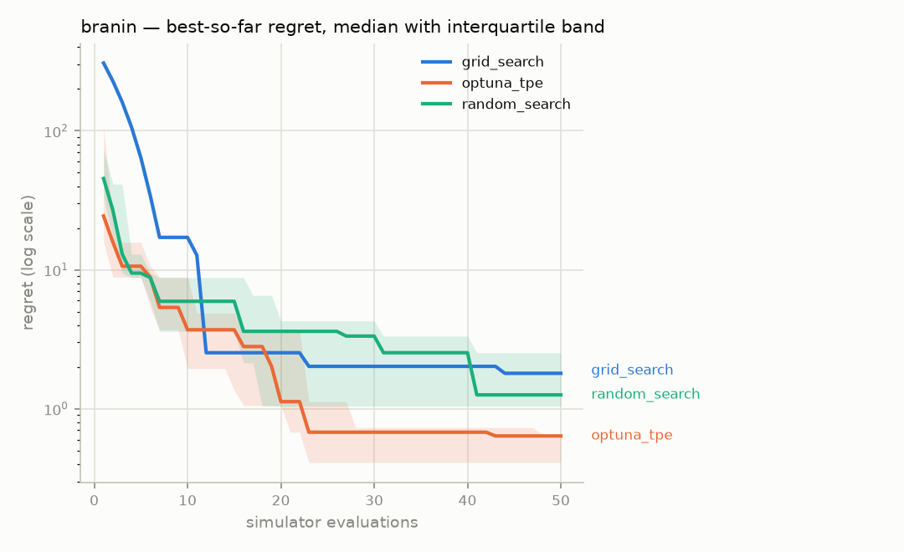
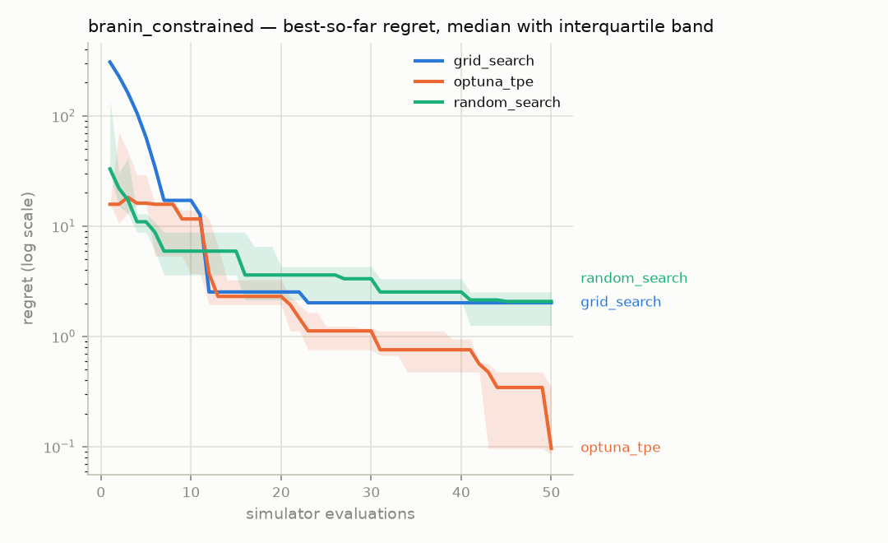
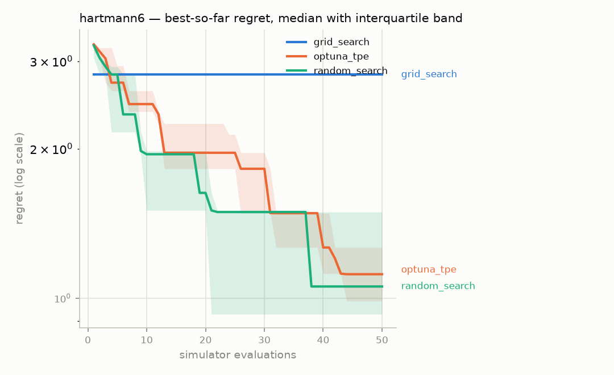
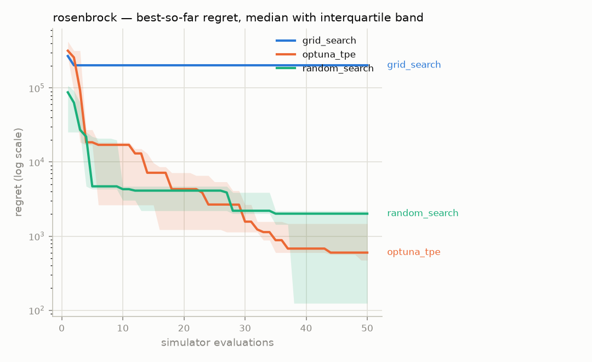

# Ablation report — `phase3-main`

Generated 2026-08-05 20:58 UTC, from 60 runs in the `episodes` table.

- Strategies: grid_search, optuna_tpe, random_search
- Benchmarks: branin, branin_constrained, hartmann6, rosenbrock
- Seeds per cell: 5
- Evaluation budget: 50 simulator calls per run

Every strategy receives the same benchmarks, the same seeds and the same
number of simulator calls. Scores are **regret** — distance from the
benchmark's known global optimum — computed over feasible results only.

## Headline — mean ± standard deviation of final regret

Lower is better.

| Strategy | branin | branin_constrained | hartmann6 | rosenbrock |
|---|---|---|---|---|
| grid_search | 1.798 ± 0 | 2.017 ± 0 | 2.817 ± 0 | 2.026e+05 ± 0 |
| optuna_tpe | 0.5302 ± 0.21 | 0.2077 ± 0.19 | 1.125 ± 0.27 | 1371 ± 1.6e+03 |
| random_search | 2.534 ± 3 | 3.138 ± 3.2 | 1.137 ± 0.43 | 1425 ± 1.3e+03 |

A standard deviation of exactly zero belongs to a deterministic strategy —
grid search does not consume the seed, so every seed produces the identical
run. That is a property of the strategy, not a suspiciously clean
measurement.

## Budget actually used, and why each run stopped

| Strategy | Benchmark | Mean evaluations | Terminated |
|---|---|---|---|
| grid_search | branin | 49 | EXHAUSTED |
| grid_search | branin_constrained | 49 | EXHAUSTED |
| grid_search | hartmann6 | 1 | EXHAUSTED |
| grid_search | rosenbrock | 16 | EXHAUSTED |
| optuna_tpe | branin | 50 | BUDGET |
| optuna_tpe | branin_constrained | 50 | BUDGET |
| optuna_tpe | hartmann6 | 50 | BUDGET |
| optuna_tpe | rosenbrock | 50 | BUDGET |
| random_search | branin | 50 | BUDGET |
| random_search | branin_constrained | 50 | BUDGET |
| random_search | hartmann6 | 50 | BUDGET |
| random_search | rosenbrock | 50 | BUDGET |

`EXHAUSTED` means the strategy ran out of things to propose before it ran
out of budget — grid search covers its whole grid and stops. `BUDGET`
means the full allowance of simulator calls was spent.

## Is the difference real?

| Benchmark | A | B | median A | median B | U | p (two-sided) | |
|---|---|---|---|---|---|---|---|
| branin | grid_search | optuna_tpe | 1.798 | 0.6365 | 25 | 0.0075 | † |
| branin | grid_search | random_search | 1.798 | 1.257 | 15 | 0.6558 | † |
| branin | optuna_tpe | random_search | 0.6365 | 1.257 | 5 | 0.1508 |  |
| branin_constrained | grid_search | optuna_tpe | 2.017 | 0.09636 | 25 | 0.0075 | † |
| branin_constrained | grid_search | random_search | 2.017 | 2.074 | 10 | 0.6558 | † |
| branin_constrained | optuna_tpe | random_search | 0.09636 | 2.074 | 0 | 0.0079 |  |
| hartmann6 | grid_search | optuna_tpe | 2.817 | 1.117 | 25 | 0.0075 | † |
| hartmann6 | grid_search | random_search | 2.817 | 1.056 | 25 | 0.0075 | † |
| hartmann6 | optuna_tpe | random_search | 1.117 | 1.056 | 12 | 1.0000 |  |
| rosenbrock | grid_search | optuna_tpe | 2.026e+05 | 599.5 | 25 | 0.0075 | † |
| rosenbrock | grid_search | random_search | 2.026e+05 | 2011 | 25 | 0.0075 | † |
| rosenbrock | optuna_tpe | random_search | 599.5 | 2011 | 13 | 1.0000 |  |

† One side of this comparison is deterministic: every seed produced an
identical run. Those are not independent observations, they are one
observation recorded once per seed, so the p-value overstates the evidence —
the test cannot tell replication from repetition. Read these rows as a
comparison of medians and disregard the p-value.

## Convergence

### branin

### branin_constrained

### hartmann6

### rosenbrock

Regret is clamped at zero and plotted on a log axis; values below 1e-06
are drawn at that floor.

## Every run

The raw numbers behind every cell above, so the table can be checked
rather than trusted.

| Strategy | Benchmark | Seed | Evaluations | Best feasible | Regret | Terminated |
|---|---|---|---|---|---|---|
| grid_search | branin | 1 | 49 | 2.19611 | 1.79822 | EXHAUSTED |
| grid_search | branin | 2 | 49 | 2.19611 | 1.79822 | EXHAUSTED |
| grid_search | branin | 3 | 49 | 2.19611 | 1.79822 | EXHAUSTED |
| grid_search | branin | 4 | 49 | 2.19611 | 1.79822 | EXHAUSTED |
| grid_search | branin | 5 | 49 | 2.19611 | 1.79822 | EXHAUSTED |
| grid_search | branin_constrained | 1 | 49 | 2.41526 | 2.01737 | EXHAUSTED |
| grid_search | branin_constrained | 2 | 49 | 2.41526 | 2.01737 | EXHAUSTED |
| grid_search | branin_constrained | 3 | 49 | 2.41526 | 2.01737 | EXHAUSTED |
| grid_search | branin_constrained | 4 | 49 | 2.41526 | 2.01737 | EXHAUSTED |
| grid_search | branin_constrained | 5 | 49 | 2.41526 | 2.01737 | EXHAUSTED |
| grid_search | hartmann6 | 1 | 1 | -0.505315 | 2.81706 | EXHAUSTED |
| grid_search | hartmann6 | 2 | 1 | -0.505315 | 2.81706 | EXHAUSTED |
| grid_search | hartmann6 | 3 | 1 | -0.505315 | 2.81706 | EXHAUSTED |
| grid_search | hartmann6 | 4 | 1 | -0.505315 | 2.81706 | EXHAUSTED |
| grid_search | hartmann6 | 5 | 1 | -0.505315 | 2.81706 | EXHAUSTED |
| grid_search | rosenbrock | 1 | 16 | 202608 | 202608 | EXHAUSTED |
| grid_search | rosenbrock | 2 | 16 | 202608 | 202608 | EXHAUSTED |
| grid_search | rosenbrock | 3 | 16 | 202608 | 202608 | EXHAUSTED |
| grid_search | rosenbrock | 4 | 16 | 202608 | 202608 | EXHAUSTED |
| grid_search | rosenbrock | 5 | 16 | 202608 | 202608 | EXHAUSTED |
| optuna_tpe | branin | 1 | 50 | 1.04627 | 0.648387 | BUDGET |
| optuna_tpe | branin | 2 | 50 | 1.03437 | 0.636483 | BUDGET |
| optuna_tpe | branin | 3 | 50 | 0.62199 | 0.224103 | BUDGET |
| optuna_tpe | branin | 4 | 50 | 0.807559 | 0.409672 | BUDGET |
| optuna_tpe | branin | 5 | 50 | 1.13002 | 0.73213 | BUDGET |
| optuna_tpe | branin_constrained | 1 | 50 | 0.436967 | 0.0390798 | BUDGET |
| optuna_tpe | branin_constrained | 2 | 50 | 0.49425 | 0.0963631 | BUDGET |
| optuna_tpe | branin_constrained | 3 | 50 | 0.74214 | 0.344253 | BUDGET |
| optuna_tpe | branin_constrained | 4 | 50 | 0.481888 | 0.0840014 | BUDGET |
| optuna_tpe | branin_constrained | 5 | 50 | 0.87285 | 0.474963 | BUDGET |
| optuna_tpe | hartmann6 | 1 | 50 | -1.83973 | 1.48264 | BUDGET |
| optuna_tpe | hartmann6 | 2 | 50 | -2.5472 | 0.775171 | BUDGET |
| optuna_tpe | hartmann6 | 3 | 50 | -2.0578 | 1.26457 | BUDGET |
| optuna_tpe | hartmann6 | 4 | 50 | -2.33578 | 0.986591 | BUDGET |
| optuna_tpe | hartmann6 | 5 | 50 | -2.20502 | 1.11735 | BUDGET |
| optuna_tpe | rosenbrock | 1 | 50 | 599.498 | 599.498 | BUDGET |
| optuna_tpe | rosenbrock | 2 | 50 | 192.845 | 192.845 | BUDGET |
| optuna_tpe | rosenbrock | 3 | 50 | 472.615 | 472.615 | BUDGET |
| optuna_tpe | rosenbrock | 4 | 50 | 1473.94 | 1473.94 | BUDGET |
| optuna_tpe | rosenbrock | 5 | 50 | 4117.25 | 4117.25 | BUDGET |
| random_search | branin | 1 | 50 | 1.65522 | 1.25734 | BUDGET |
| random_search | branin | 2 | 50 | 1.44166 | 1.04378 | BUDGET |
| random_search | branin | 3 | 50 | 2.92669 | 2.5288 | BUDGET |
| random_search | branin | 4 | 50 | 8.1049 | 7.70702 | BUDGET |
| random_search | branin | 5 | 50 | 0.528581 | 0.130694 | BUDGET |
| random_search | branin_constrained | 1 | 50 | 1.65522 | 1.25734 | BUDGET |
| random_search | branin_constrained | 2 | 50 | 1.44166 | 1.04378 | BUDGET |
| random_search | branin_constrained | 3 | 50 | 2.92669 | 2.5288 | BUDGET |
| random_search | branin_constrained | 4 | 50 | 9.18497 | 8.78709 | BUDGET |
| random_search | branin_constrained | 5 | 50 | 2.47238 | 2.07449 | BUDGET |
| random_search | hartmann6 | 1 | 50 | -1.83181 | 1.49056 | BUDGET |
| random_search | hartmann6 | 2 | 50 | -1.69352 | 1.62885 | BUDGET |
| random_search | hartmann6 | 3 | 50 | -2.74062 | 0.58175 | BUDGET |
| random_search | hartmann6 | 4 | 50 | -2.26684 | 1.05553 | BUDGET |
| random_search | hartmann6 | 5 | 50 | -2.39411 | 0.928264 | BUDGET |
| random_search | rosenbrock | 1 | 50 | 2010.84 | 2010.84 | BUDGET |
| random_search | rosenbrock | 2 | 50 | 2201.37 | 2201.37 | BUDGET |
| random_search | rosenbrock | 3 | 50 | 2754.14 | 2754.14 | BUDGET |
| random_search | rosenbrock | 4 | 50 | 37.142 | 37.142 | BUDGET |
| random_search | rosenbrock | 5 | 50 | 123.88 | 123.88 | BUDGET |
