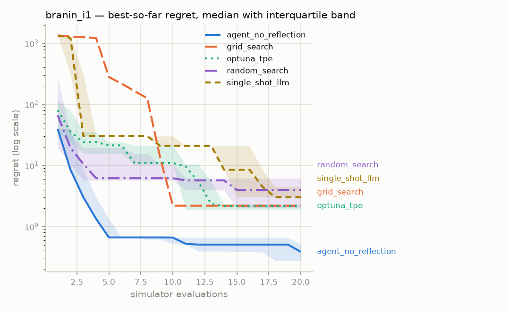
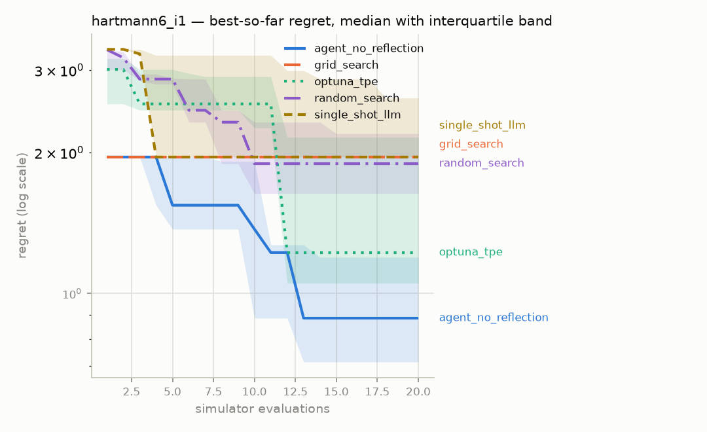

# Ablation report — `phase35-main`

Generated 2026-08-06 21:27 UTC, from 50 runs in the `episodes` table.

- Strategies: agent_no_reflection, grid_search, optuna_tpe, random_search, single_shot_llm
- Benchmarks: branin_i1, hartmann6_i1
- Seeds per cell: 5
- Evaluation budget: 20 simulator calls per run

Every strategy receives the same benchmarks, the same seeds and the same
number of simulator calls. Scores are **regret** — distance from the
benchmark's known global optimum — computed over feasible results only.

## Headline — mean ± standard deviation of final regret

Lower is better.

| Strategy | branin_i1 | hartmann6_i1 |
|---|---|---|
| agent_no_reflection | 0.3809 ± 0.23 | 1.052 ± 0.56 |
| grid_search | 2.196 ± 0 | 1.956 ± 0 |
| optuna_tpe | 2.838 ± 2.5 | 1.54 ± 0.64 |
| random_search | 4.689 ± 3.4 | 1.684 ± 0.78 |
| single_shot_llm | 4.236 ± 2.5 | 2.347 ± 0.58 |

A standard deviation of exactly zero belongs to a deterministic strategy —
grid search does not consume the seed, so every seed produces the identical
run. That is a property of the strategy, not a suspiciously clean
measurement.

## Budget actually used, and why each run stopped

| Strategy | Benchmark | Mean evaluations | Terminated |
|---|---|---|---|
| agent_no_reflection | branin_i1 | 20 | BUDGET |
| agent_no_reflection | hartmann6_i1 | 20 | BUDGET |
| grid_search | branin_i1 | 16 | EXHAUSTED |
| grid_search | hartmann6_i1 | 1 | EXHAUSTED |
| optuna_tpe | branin_i1 | 20 | BUDGET |
| optuna_tpe | hartmann6_i1 | 20 | BUDGET |
| random_search | branin_i1 | 20 | BUDGET |
| random_search | hartmann6_i1 | 20 | BUDGET |
| single_shot_llm | branin_i1 | 19 | BUDGET, EXHAUSTED |
| single_shot_llm | hartmann6_i1 | 16 | BUDGET, EXHAUSTED |

`EXHAUSTED` means the strategy ran out of things to propose before it ran
out of budget — grid search covers its whole grid and stops. `BUDGET`
means the full allowance of simulator calls was spent.

## Is the difference real?

| Benchmark | A | B | median A | median B | U | p (two-sided) | |
|---|---|---|---|---|---|---|---|
| branin_i1 | agent_no_reflection | grid_search | 0.3861 | 2.196 | 0 | 0.0075 | † |
| branin_i1 | agent_no_reflection | optuna_tpe | 0.3861 | 2.17 | 1 | 0.0159 |  |
| branin_i1 | agent_no_reflection | random_search | 0.3861 | 3.976 | 0 | 0.0079 |  |
| branin_i1 | agent_no_reflection | single_shot_llm | 0.3861 | 3.035 | 0 | 0.0119 |  |
| branin_i1 | grid_search | optuna_tpe | 2.196 | 2.17 | 15 | 0.6558 | † |
| branin_i1 | grid_search | random_search | 2.196 | 3.976 | 10 | 0.6558 | † |
| branin_i1 | grid_search | single_shot_llm | 2.196 | 3.035 | 5 | 0.1175 | † |
| branin_i1 | optuna_tpe | random_search | 2.17 | 3.976 | 9 | 0.5476 |  |
| branin_i1 | optuna_tpe | single_shot_llm | 2.17 | 3.035 | 6 | 0.2087 |  |
| branin_i1 | random_search | single_shot_llm | 3.976 | 3.035 | 12 | 1.0000 |  |
| hartmann6_i1 | agent_no_reflection | grid_search | 0.886 | 1.956 | 2 | 0.0254 | † |
| hartmann6_i1 | agent_no_reflection | optuna_tpe | 0.886 | 1.223 | 5 | 0.1508 |  |
| hartmann6_i1 | agent_no_reflection | random_search | 0.886 | 1.894 | 7 | 0.3095 |  |
| hartmann6_i1 | agent_no_reflection | single_shot_llm | 0.886 | 1.956 | 2 | 0.0236 |  |
| hartmann6_i1 | grid_search | optuna_tpe | 1.956 | 1.223 | 15 | 0.6558 | † |
| hartmann6_i1 | grid_search | random_search | 1.956 | 1.894 | 15 | 0.6558 | † |
| hartmann6_i1 | grid_search | single_shot_llm | 1.956 | 1.956 | 8 | 0.1797 | † |
| hartmann6_i1 | optuna_tpe | random_search | 1.223 | 1.894 | 10 | 0.6905 |  |
| hartmann6_i1 | optuna_tpe | single_shot_llm | 1.223 | 1.956 | 6 | 0.2045 |  |
| hartmann6_i1 | random_search | single_shot_llm | 1.894 | 1.956 | 6 | 0.2045 |  |

† One side of this comparison is deterministic: every seed produced an
identical run. Those are not independent observations, they are one
observation recorded once per seed, so the p-value overstates the evidence —
the test cannot tell replication from repetition. Read these rows as a
comparison of medians and disregard the p-value.

## Structured output — did the model return usable JSON?

Counted over calls that reached a provider; replays from the cache are
excluded, or a re-run would report 100%. Constrained decoding guarantees
the reply *parses*, so what is measured here is stricter: replies the
Pydantic schema accepted **on the first attempt**, with calls that never
produced valid output at all counted in the denominator.

| Strategy | Model calls | Valid first try | Needed repair | Never valid | Compliance |
|---|---|---|---|---|---|
| agent_no_reflection | 200 | 200 | 0 | 0 | 100.0% |
| single_shot_llm | 10 | 10 | 0 | 0 | 100.0% |

## Seed noise floor

Measured by running each baseline over many more seeds than the protocol
requires, then repeatedly drawing 5 of them at random and taking the
mean. The spread column is how far apart two 5-seed means can be when
nothing differs but the seeds — **a gap smaller than that proves nothing.**

| Strategy | Benchmark | Seeds run | Mean regret | 90% interval of a 5-seed mean | Spread |
|---|---|---|---|---|---|
| optuna_tpe | branin_i1 | 30 | 4.016 | [1.855, 6.82] | 4.965 |
| optuna_tpe | hartmann6_i1 | 30 | 1.686 | [1.297, 2.058] | 0.7617 |
| random_search | branin_i1 | 30 | 7.071 | [3.666, 10.95] | 7.279 |
| random_search | hartmann6_i1 | 30 | 2.1 | [1.683, 2.457] | 0.7735 |

## Convergence

### branin_i1

### hartmann6_i1

Regret is clamped at zero and plotted on a log axis; values below 1e-06
are drawn at that floor.

## Every run

The raw numbers behind every cell above, so the table can be checked
rather than trusted.

| Strategy | Benchmark | Seed | Evaluations | Best feasible | Regret | Terminated |
|---|---|---|---|---|---|---|
| agent_no_reflection | branin_i1 | 1 | 20 | 0.904466 | 0.506579 | BUDGET |
| agent_no_reflection | branin_i1 | 2 | 20 | 0.783973 | 0.386086 | BUDGET |
| agent_no_reflection | branin_i1 | 3 | 20 | 1.06288 | 0.664989 | BUDGET |
| agent_no_reflection | branin_i1 | 4 | 20 | 0.675643 | 0.277756 | BUDGET |
| agent_no_reflection | branin_i1 | 5 | 20 | 0.466858 | 0.068971 | BUDGET |
| agent_no_reflection | hartmann6_i1 | 1 | 20 | -2.81293 | 0.509437 | BUDGET |
| agent_no_reflection | hartmann6_i1 | 2 | 20 | -2.12751 | 1.19486 | BUDGET |
| agent_no_reflection | hartmann6_i1 | 3 | 20 | -2.43638 | 0.885994 | BUDGET |
| agent_no_reflection | hartmann6_i1 | 4 | 20 | -1.36606 | 1.95631 | BUDGET |
| agent_no_reflection | hartmann6_i1 | 5 | 20 | -2.60812 | 0.71425 | BUDGET |
| grid_search | branin_i1 | 1 | 16 | 2.59374 | 2.19586 | EXHAUSTED |
| grid_search | branin_i1 | 2 | 16 | 2.59374 | 2.19586 | EXHAUSTED |
| grid_search | branin_i1 | 3 | 16 | 2.59374 | 2.19586 | EXHAUSTED |
| grid_search | branin_i1 | 4 | 16 | 2.59374 | 2.19586 | EXHAUSTED |
| grid_search | branin_i1 | 5 | 16 | 2.59374 | 2.19586 | EXHAUSTED |
| grid_search | hartmann6_i1 | 1 | 1 | -1.36606 | 1.95631 | EXHAUSTED |
| grid_search | hartmann6_i1 | 2 | 1 | -1.36606 | 1.95631 | EXHAUSTED |
| grid_search | hartmann6_i1 | 3 | 1 | -1.36606 | 1.95631 | EXHAUSTED |
| grid_search | hartmann6_i1 | 4 | 1 | -1.36606 | 1.95631 | EXHAUSTED |
| grid_search | hartmann6_i1 | 5 | 1 | -1.36606 | 1.95631 | EXHAUSTED |
| optuna_tpe | branin_i1 | 1 | 20 | 2.73915 | 2.34126 | BUDGET |
| optuna_tpe | branin_i1 | 2 | 20 | 7.54876 | 7.15088 | BUDGET |
| optuna_tpe | branin_i1 | 3 | 20 | 2.56794 | 2.17006 | BUDGET |
| optuna_tpe | branin_i1 | 4 | 20 | 1.03024 | 0.63235 | BUDGET |
| optuna_tpe | branin_i1 | 5 | 20 | 2.29408 | 1.89619 | BUDGET |
| optuna_tpe | hartmann6_i1 | 1 | 20 | -2.35067 | 0.971696 | BUDGET |
| optuna_tpe | hartmann6_i1 | 2 | 20 | -1.16665 | 2.15572 | BUDGET |
| optuna_tpe | hartmann6_i1 | 3 | 20 | -2.27024 | 1.05213 | BUDGET |
| optuna_tpe | hartmann6_i1 | 4 | 20 | -2.09986 | 1.22251 | BUDGET |
| optuna_tpe | hartmann6_i1 | 5 | 20 | -1.02582 | 2.29655 | BUDGET |
| random_search | branin_i1 | 1 | 20 | 4.37411 | 3.97622 | BUDGET |
| random_search | branin_i1 | 2 | 20 | 1.85322 | 1.45534 | BUDGET |
| random_search | branin_i1 | 3 | 20 | 6.58697 | 6.18909 | BUDGET |
| random_search | branin_i1 | 4 | 20 | 10.2125 | 9.81458 | BUDGET |
| random_search | branin_i1 | 5 | 20 | 2.40958 | 2.0117 | BUDGET |
| random_search | hartmann6_i1 | 1 | 20 | -1.42857 | 1.8938 | BUDGET |
| random_search | hartmann6_i1 | 2 | 20 | -1.68675 | 1.63562 | BUDGET |
| random_search | hartmann6_i1 | 3 | 20 | -2.94836 | 0.374009 | BUDGET |
| random_search | hartmann6_i1 | 4 | 20 | -1.00046 | 2.32191 | BUDGET |
| random_search | hartmann6_i1 | 5 | 20 | -1.12718 | 2.19519 | BUDGET |
| single_shot_llm | branin_i1 | 1 | 20 | 3.43249 | 3.0346 | BUDGET |
| single_shot_llm | branin_i1 | 2 | 19 | 8.91356 | 8.51568 | EXHAUSTED |
| single_shot_llm | branin_i1 | 3 | 19 | 4.88601 | 4.48812 | EXHAUSTED |
| single_shot_llm | branin_i1 | 4 | 19 | 2.50553 | 2.10765 | EXHAUSTED |
| single_shot_llm | branin_i1 | 5 | 20 | 3.43249 | 3.0346 | BUDGET |
| single_shot_llm | hartmann6_i1 | 1 | 3 | -0.0737821 | 3.24859 | EXHAUSTED |
| single_shot_llm | hartmann6_i1 | 2 | 18 | -1.36606 | 1.95631 | EXHAUSTED |
| single_shot_llm | hartmann6_i1 | 3 | 19 | -1.36606 | 1.95631 | EXHAUSTED |
| single_shot_llm | hartmann6_i1 | 4 | 20 | -1.36606 | 1.95631 | BUDGET |
| single_shot_llm | hartmann6_i1 | 5 | 19 | -0.706159 | 2.61621 | EXHAUSTED |
