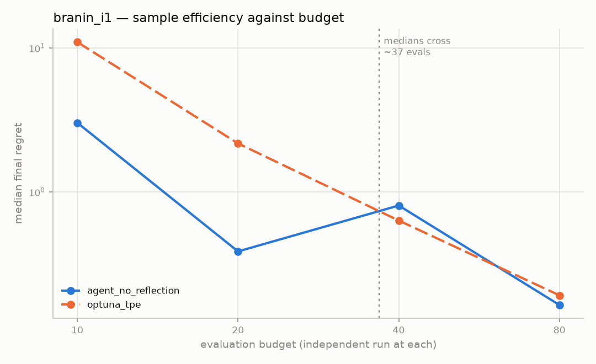
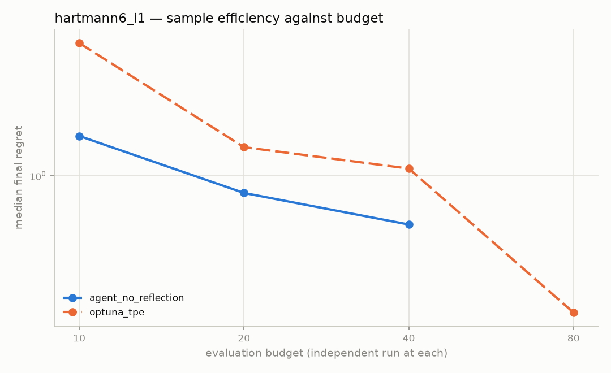

# Budget sweep — regret against evaluation count

Experiments: phase35-sweep-10, phase35-main, phase35-sweep-40, phase35-sweep-80

Every point is an **independent run at that budget**, not a prefix of a
longer run. The planner is told its budget in the prompt, so a run that
knows it has 80 evaluations behaves differently from one that knows it has
10; truncating the long run would measure the wrong thing.

Values are median final regret over the seeds in each cell.

## branin_i1

| Strategy | 10 evals | 20 evals | 40 evals | 80 evals |
|---|---|---|---|---|
| agent_no_reflection | 3.02 | 0.3861 | 0.8045 | 0.1638 |
| optuna_tpe | 10.98 | 2.17 | 0.6324 | 0.1912 |

⚠ **Unequal seeds.** Most cells here use 5 seeds; these do not: agent_no_reflection at 80 evals (n=3). Their medians are drawn from fewer runs and are less stable than the rest of the curve.

### Is the gap real at each budget? (`agent_no_reflection` vs `optuna_tpe`)

| Budget | Leading median | n per group | p (Mann-Whitney, exact, two-sided) | |
|---|---|---|---|---|
| 10 | agent_no_reflection | 5 | 0.0556 | not significant |
| 20 | agent_no_reflection | 5 | 0.0159 | **significant** |
| 40 | optuna_tpe | 5 | 0.6905 | not significant |
| 80 | agent_no_reflection | 3 | 1.0000 | not significant |

A leading median with a large p-value means the two distributions overlap: the ordering is what these particular seeds produced, not a property of the strategies.

The medians cross near 37 evaluations (`agent_no_reflection` below, `optuna_tpe` above) — **but this is not a supported crossover.** No budget above the crossing shows a significant difference, so what the curves record is one strategy's advantage fading into noise rather than the other overtaking it. Reported as a median crossing only.

## hartmann6_i1

| Strategy | 10 evals | 20 evals | 40 evals | 80 evals |
|---|---|---|---|---|
| agent_no_reflection | 1.323 | 0.886 | 0.71 | — |
| optuna_tpe | 2.54 | 1.223 | 1.052 | 0.3824 |

### Is the gap real at each budget? (`agent_no_reflection` vs `optuna_tpe`)

| Budget | Leading median | n per group | p (Mann-Whitney, exact, two-sided) | |
|---|---|---|---|---|
| 10 | agent_no_reflection | 5 | 0.0556 | not significant |
| 20 | agent_no_reflection | 5 | 0.1508 | not significant |
| 40 | agent_no_reflection | 5 | 0.4206 | not significant |

A leading median with a large p-value means the two distributions overlap: the ordering is what these particular seeds produced, not a property of the strategies.

The median of `agent_no_reflection` and `optuna_tpe` do not cross within the budgets measured.

