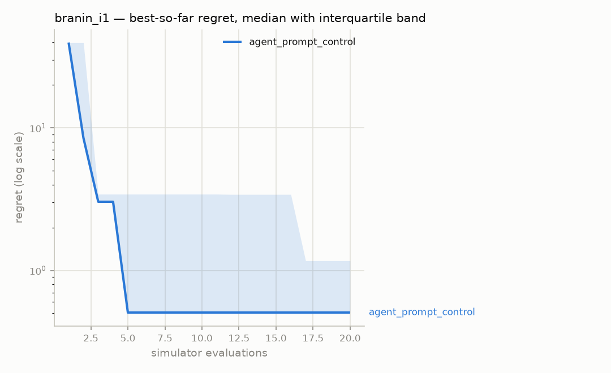
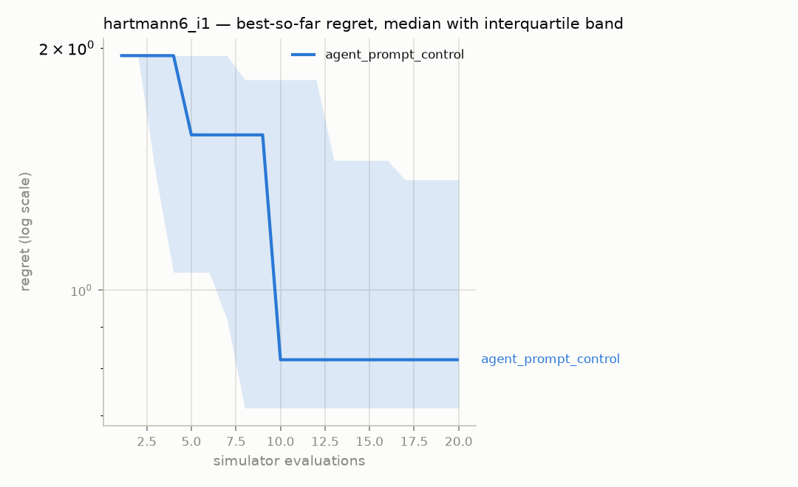

# Ablation report — `phase4-control`

Generated 2026-08-07 10:19 UTC, from 10 runs in the `episodes` table.

- Strategies: agent_prompt_control
- Benchmarks: branin_i1, hartmann6_i1
- Seeds per cell: 5
- Evaluation budget: 20 simulator calls per run
- Significance test: Mann-Whitney U, two-sided, exact (n=5 per group)
- Optuna `n_startup_trials`: 10 — TPE samples this many trials at random before its model takes over

**Read the TPE line above carefully at small budgets.** At 20 evaluations it means 10 of the 20 are random search, so TPE is being asked to work in a regime it is not designed for. That is deliberate and was measured rather than assumed: lowering it to 3 or 5 makes TPE *worse* at these budgets, because the estimator needs those observations to build a density over. See the Phase 3.5 log.

A rank test is used rather than a t-test because regret distributions here are heavily right-skewed — one unlucky seed sits orders of magnitude above the rest — which violates the normality a t-test assumes and would let a single outlier drive the result.

Every strategy receives the same benchmarks, the same seeds and the same
number of simulator calls. Scores are **regret** — distance from the
benchmark's known global optimum — computed over feasible results only.

## Headline — mean ± standard deviation of final regret

Lower is better.

| Strategy | branin_i1 | hartmann6_i1 |
|---|---|---|
| agent_prompt_control | 1.666 ± 2.5 | 0.9663 ± 0.63 |

## Budget actually used, and why each run stopped

| Strategy | Benchmark | Mean evaluations | Terminated |
|---|---|---|---|
| agent_prompt_control | branin_i1 | 20 | BUDGET |
| agent_prompt_control | hartmann6_i1 | 20 | BUDGET |

`EXHAUSTED` means the strategy ran out of things to propose before it ran
out of budget — grid search covers its whole grid and stops. `BUDGET`
means the full allowance of simulator calls was spent.

## Is the difference real?

_Not enough seeds per cell to run a rank test — at least 3 are needed, and the protocol's 5 is the practical minimum for a two-sided result._

## What reflection cost

Read this next to the headline. A reflecting episode is three model
requests — planner, critic, replanner — against one for a planner-only
agent, for the *same single simulator call*. This ablation holds the
evaluation budget equal, which is the right thing to hold equal when the
premise is that a simulator call costs minutes and a token costs nothing.

But it means any advantage shown above is **sample efficiency**, not
efficiency in general. If evaluations are cheap, this trade is a bad one.

| Strategy | Runs | Model requests | Requests per evaluation | Prompt tokens | Completion tokens |
|---|---|---|---|---|---|
| agent_prompt_control | 10 | 200 | 1.00 | 199,549 | 20,413 |

## Structured output — did the model return usable JSON?

Counted over calls that reached a provider; replays from the cache are
excluded, or a re-run would report 100%. Constrained decoding guarantees
the reply *parses*, so what is measured here is stricter: replies the
Pydantic schema accepted **on the first attempt**, with calls that never
produced valid output at all counted in the denominator.

| Strategy | Model calls | Valid first try | Needed repair | Never valid | Compliance |
|---|---|---|---|---|---|
| agent_prompt_control | 200 | 200 | 0 | 0 | 100.0% |

## Convergence

### branin_i1

### hartmann6_i1

Regret is clamped at zero and plotted on a log axis; values below 1e-06
are drawn at that floor.

## Every run

The raw numbers behind every cell above, so the table can be checked
rather than trusted.

| Strategy | Benchmark | Seed | Evaluations | Best feasible | Regret | Terminated |
|---|---|---|---|---|---|---|
| agent_prompt_control | branin_i1 | 1 | 20 | 6.45888 | 6.061 | BUDGET |
| agent_prompt_control | branin_i1 | 2 | 20 | 0.904466 | 0.506579 | BUDGET |
| agent_prompt_control | branin_i1 | 3 | 20 | 0.904466 | 0.506579 | BUDGET |
| agent_prompt_control | branin_i1 | 4 | 20 | 1.56789 | 1.17 | BUDGET |
| agent_prompt_control | branin_i1 | 5 | 20 | 0.481705 | 0.0838183 | BUDGET |
| agent_prompt_control | hartmann6_i1 | 1 | 20 | -1.54601 | 1.77636 | BUDGET |
| agent_prompt_control | hartmann6_i1 | 2 | 20 | -3.17263 | 0.149743 | BUDGET |
| agent_prompt_control | hartmann6_i1 | 3 | 20 | -2.50244 | 0.819933 | BUDGET |
| agent_prompt_control | hartmann6_i1 | 4 | 20 | -1.95106 | 1.37131 | BUDGET |
| agent_prompt_control | hartmann6_i1 | 5 | 20 | -2.60822 | 0.714154 | BUDGET |
