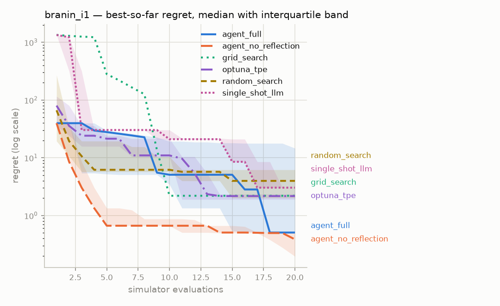
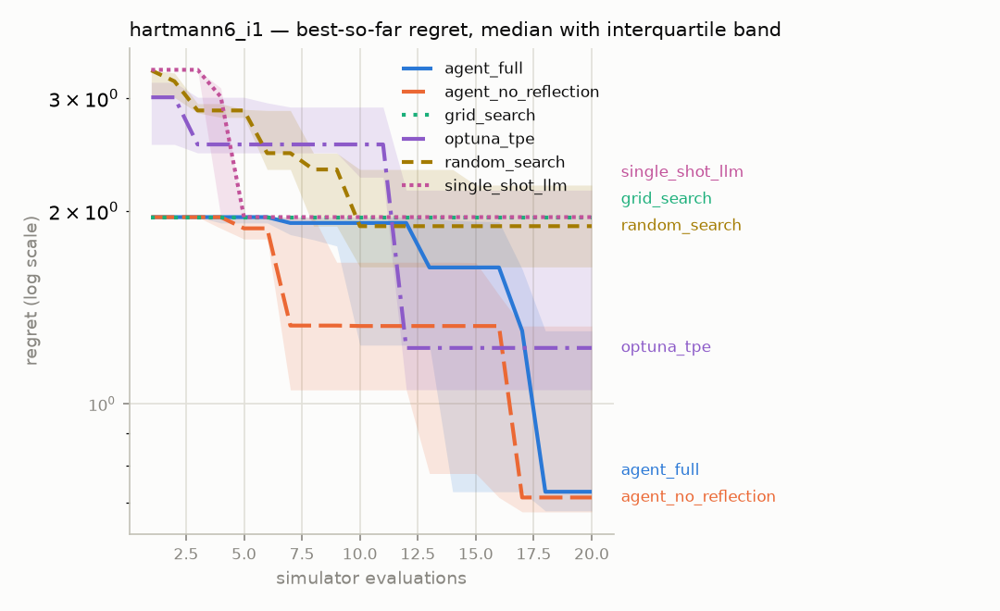

# Ablation report — `phase4-main`

Generated 2026-08-07 09:57 UTC, from 60 runs in the `episodes` table.

- Strategies: agent_full, agent_no_reflection, grid_search, optuna_tpe, random_search, single_shot_llm
- Benchmarks: branin_i1, hartmann6_i1
- Seeds per cell: 5
- Evaluation budget: 20 simulator calls per run
- Significance test: Mann-Whitney U, two-sided, exact (n=5 per group)
- Optuna `n_startup_trials`: 10 — TPE samples this many trials at random before its model takes over

**Read the TPE line above carefully at small budgets.** At 20 evaluations it means 10 of the 20 are random search, so TPE is being asked to work in a regime it is not designed for. That is deliberate and was measured rather than assumed: lowering it to 3 or 5 makes TPE *worse* at these budgets, because the estimator needs those observations to build a density over. See the Phase 3.5 log.

A rank test is used rather than a t-test because regret distributions here are heavily right-skewed — one unlucky seed sits orders of magnitude above the rest — which violates the normality a t-test assumes and would let a single outlier drive the result.

Every strategy receives the same benchmarks, the same seeds and the same
number of simulator calls. Scores are **regret** — distance from the
benchmark's known global optimum — computed over feasible results only.

## Headline — mean ± standard deviation of final regret

Lower is better.

| Strategy | branin_i1 | hartmann6_i1 |
|---|---|---|
| agent_full | 7.104 ± 9.2 | 1.048 ± 0.56 |
| agent_no_reflection | 0.3308 ± 0.19 | 0.9436 ± 0.43 |
| grid_search | 2.196 ± 0 | 1.956 ± 0 |
| optuna_tpe | 2.838 ± 2.5 | 1.54 ± 0.64 |
| random_search | 4.689 ± 3.4 | 1.684 ± 0.78 |
| single_shot_llm | 2.849 ± 0.41 | 1.956 ± 0 |

A standard deviation of exactly zero belongs to a deterministic strategy —
grid search does not consume the seed, so every seed produces the identical
run. That is a property of the strategy, not a suspiciously clean
measurement.

## Budget actually used, and why each run stopped

| Strategy | Benchmark | Mean evaluations | Terminated |
|---|---|---|---|
| agent_full | branin_i1 | 20 | BUDGET |
| agent_full | hartmann6_i1 | 20 | BUDGET |
| agent_no_reflection | branin_i1 | 20 | BUDGET |
| agent_no_reflection | hartmann6_i1 | 20 | BUDGET |
| grid_search | branin_i1 | 16 | EXHAUSTED |
| grid_search | hartmann6_i1 | 1 | EXHAUSTED |
| optuna_tpe | branin_i1 | 20 | BUDGET |
| optuna_tpe | hartmann6_i1 | 20 | BUDGET |
| random_search | branin_i1 | 20 | BUDGET |
| random_search | hartmann6_i1 | 20 | BUDGET |
| single_shot_llm | branin_i1 | 19 | BUDGET, EXHAUSTED |
| single_shot_llm | hartmann6_i1 | 19 | BUDGET, EXHAUSTED |

`EXHAUSTED` means the strategy ran out of things to propose before it ran
out of budget — grid search covers its whole grid and stops. `BUDGET`
means the full allowance of simulator calls was spent.

## Is the difference real?

| Benchmark | A | B | median A | median B | U | p (two-sided) | |
|---|---|---|---|---|---|---|---|
| branin_i1 | agent_full | agent_no_reflection | 0.5066 | 0.3861 | 22 | 0.0556 |  |
| branin_i1 | agent_full | grid_search | 0.5066 | 2.196 | 10 | 0.6905 | † |
| branin_i1 | agent_full | optuna_tpe | 0.5066 | 2.17 | 10 | 0.6905 |  |
| branin_i1 | agent_full | random_search | 0.5066 | 3.976 | 10 | 0.6905 |  |
| branin_i1 | agent_full | single_shot_llm | 0.5066 | 3.035 | 10 | 0.6905 |  |
| branin_i1 | agent_no_reflection | grid_search | 0.3861 | 2.196 | 0 | 0.0079 | † |
| branin_i1 | agent_no_reflection | optuna_tpe | 0.3861 | 2.17 | 0 | 0.0079 |  |
| branin_i1 | agent_no_reflection | random_search | 0.3861 | 3.976 | 0 | 0.0079 |  |
| branin_i1 | agent_no_reflection | single_shot_llm | 0.3861 | 3.035 | 0 | 0.0079 |  |
| branin_i1 | grid_search | optuna_tpe | 2.196 | 2.17 | 15 | 0.6905 | † |
| branin_i1 | grid_search | random_search | 2.196 | 3.976 | 10 | 0.6905 | † |
| branin_i1 | grid_search | single_shot_llm | 2.196 | 3.035 | 5 | 0.1508 | † |
| branin_i1 | optuna_tpe | random_search | 2.17 | 3.976 | 9 | 0.5476 |  |
| branin_i1 | optuna_tpe | single_shot_llm | 2.17 | 3.035 | 7 | 0.3095 |  |
| branin_i1 | random_search | single_shot_llm | 3.976 | 3.035 | 15 | 0.6905 |  |
| hartmann6_i1 | agent_full | agent_no_reflection | 0.729 | 0.7142 | 14 | 0.8413 |  |
| hartmann6_i1 | agent_full | grid_search | 0.729 | 1.956 | 0 | 0.0079 | † |
| hartmann6_i1 | agent_full | optuna_tpe | 0.729 | 1.223 | 6 | 0.2222 |  |
| hartmann6_i1 | agent_full | random_search | 0.729 | 1.894 | 7 | 0.3095 |  |
| hartmann6_i1 | agent_full | single_shot_llm | 0.729 | 1.956 | 0 | 0.0079 | † |
| hartmann6_i1 | agent_no_reflection | grid_search | 0.7142 | 1.956 | 0 | 0.0079 | † |
| hartmann6_i1 | agent_no_reflection | optuna_tpe | 0.7142 | 1.223 | 6 | 0.2222 |  |
| hartmann6_i1 | agent_no_reflection | random_search | 0.7142 | 1.894 | 5 | 0.1508 |  |
| hartmann6_i1 | agent_no_reflection | single_shot_llm | 0.7142 | 1.956 | 0 | 0.0079 | † |
| hartmann6_i1 | grid_search | optuna_tpe | 1.956 | 1.223 | 15 | 0.6905 | † |
| hartmann6_i1 | grid_search | random_search | 1.956 | 1.894 | 15 | 0.6905 | † |
| hartmann6_i1 | grid_search | single_shot_llm | 1.956 | 1.956 | 12 | 1.0000 | † |
| hartmann6_i1 | optuna_tpe | random_search | 1.223 | 1.894 | 10 | 0.6905 |  |
| hartmann6_i1 | optuna_tpe | single_shot_llm | 1.223 | 1.956 | 10 | 0.6905 | † |
| hartmann6_i1 | random_search | single_shot_llm | 1.894 | 1.956 | 10 | 0.6905 | † |

† One side of this comparison is deterministic: every seed produced an
identical run. Those are not independent observations, they are one
observation recorded once per seed, so the p-value overstates the evidence —
the test cannot tell replication from repetition. Read these rows as a
comparison of medians and disregard the p-value.

## Reflection — what the critic and replanner did

Counted from the episodes table. `Episodes diagnosed` excludes episodes
where the critic could not be reached; those are counted separately as
`Reflection failures`, because *the critic said nothing useful* and *the
critic was down* are different findings.

| Strategy | Runs | Episodes diagnosed | Mean confidence | Decisions | TERMINATE recommended | Reflection failures |
|---|---|---|---|---|---|---|
| agent_full | 10 | 200 | 0.59 | EXPLOIT 109, EXPLORE 70, REPAIR 20, TERMINATE 1 | 1 (0%) | 0 |

**`TERMINATE recommended` was recorded and not obeyed.** The replanner may
recommend stopping; the loop does not stop. Termination is deterministic
code's decision (Rule 2), and a strategy allowed to end its own run early
would not be sitting the same exam as the others — the evaluation budget
being identical across strategies is the single property this comparison
rests on. The recommendation is therefore a number in this table rather
than a confound in the one above it.

## What reflection cost

Read this next to the headline. A reflecting episode is three model
requests — planner, critic, replanner — against one for a planner-only
agent, for the *same single simulator call*. This ablation holds the
evaluation budget equal, which is the right thing to hold equal when the
premise is that a simulator call costs minutes and a token costs nothing.

But it means any advantage shown above is **sample efficiency**, not
efficiency in general. If evaluations are cheap, this trade is a bad one.

| Strategy | Runs | Model requests | Requests per evaluation | Prompt tokens | Completion tokens |
|---|---|---|---|---|---|
| agent_full | 10 | 600 | 3.00 | 673,036 | 65,901 |
| agent_no_reflection | 10 | 200 | 1.00 | 176,354 | 23,809 |
| single_shot_llm | 10 | 10 | 0.05 | 75,588 | 218,259 |

## Structured output — did the model return usable JSON?

Counted over calls that reached a provider; replays from the cache are
excluded, or a re-run would report 100%. Constrained decoding guarantees
the reply *parses*, so what is measured here is stricter: replies the
Pydantic schema accepted **on the first attempt**, with calls that never
produced valid output at all counted in the denominator.

| Strategy | Model calls | Valid first try | Needed repair | Never valid | Compliance |
|---|---|---|---|---|---|
| agent_full | 600 | 600 | 0 | 0 | 100.0% |
| agent_no_reflection | 200 | 200 | 0 | 0 | 100.0% |
| single_shot_llm | 10 | 10 | 0 | 0 | 100.0% |

## Seed noise floor

Measured by running each baseline over many more seeds than the protocol
requires, then repeatedly drawing 5 of them at random and taking the
mean. The spread column is how far apart two 5-seed means can be when
nothing differs but the seeds — **a gap smaller than that proves nothing.**

| Strategy | Benchmark | Seeds run | Mean regret | 90% interval of a 5-seed mean | Spread |
|---|---|---|---|---|---|
| optuna_tpe | branin_i1 | 30 | 4.016 | [1.855, 6.82] | 4.965 |
| optuna_tpe | hartmann6_i1 | 30 | 1.686 | [1.297, 2.058] | 0.7617 |
| random_search | branin_i1 | 30 | 7.071 | [3.666, 10.95] | 7.279 |
| random_search | hartmann6_i1 | 30 | 2.1 | [1.683, 2.457] | 0.7735 |

## Convergence

### branin_i1

### hartmann6_i1

Regret is clamped at zero and plotted on a log axis; values below 1e-06
are drawn at that floor.

## Every run

The raw numbers behind every cell above, so the table can be checked
rather than trusted.

| Strategy | Benchmark | Seed | Evaluations | Best feasible | Regret | Terminated |
|---|---|---|---|---|---|---|
| agent_full | branin_i1 | 1 | 20 | 0.904466 | 0.506579 | BUDGET |
| agent_full | branin_i1 | 2 | 20 | 19.901 | 19.5031 | BUDGET |
| agent_full | branin_i1 | 3 | 20 | 15.0051 | 14.6072 | BUDGET |
| agent_full | branin_i1 | 4 | 20 | 0.904466 | 0.506579 | BUDGET |
| agent_full | branin_i1 | 5 | 20 | 0.792757 | 0.39487 | BUDGET |
| agent_full | hartmann6_i1 | 1 | 20 | -2.02211 | 1.30026 | BUDGET |
| agent_full | hartmann6_i1 | 2 | 20 | -1.39903 | 1.92334 | BUDGET |
| agent_full | hartmann6_i1 | 3 | 20 | -2.6417 | 0.680671 | BUDGET |
| agent_full | hartmann6_i1 | 4 | 20 | -2.59335 | 0.729018 | BUDGET |
| agent_full | hartmann6_i1 | 5 | 20 | -2.71594 | 0.606428 | BUDGET |
| agent_no_reflection | branin_i1 | 1 | 20 | 0.904466 | 0.506579 | BUDGET |
| agent_no_reflection | branin_i1 | 2 | 20 | 0.783973 | 0.386086 | BUDGET |
| agent_no_reflection | branin_i1 | 3 | 20 | 0.894414 | 0.496527 | BUDGET |
| agent_no_reflection | branin_i1 | 4 | 20 | 0.593491 | 0.195604 | BUDGET |
| agent_no_reflection | branin_i1 | 5 | 20 | 0.466858 | 0.068971 | BUDGET |
| agent_no_reflection | hartmann6_i1 | 1 | 20 | -2.64445 | 0.677921 | BUDGET |
| agent_no_reflection | hartmann6_i1 | 2 | 20 | -2.79765 | 0.524722 | BUDGET |
| agent_no_reflection | hartmann6_i1 | 3 | 20 | -1.84388 | 1.47849 | BUDGET |
| agent_no_reflection | hartmann6_i1 | 4 | 20 | -1.99966 | 1.32271 | BUDGET |
| agent_no_reflection | hartmann6_i1 | 5 | 20 | -2.60822 | 0.714154 | BUDGET |
| grid_search | branin_i1 | 1 | 16 | 2.59374 | 2.19586 | EXHAUSTED |
| grid_search | branin_i1 | 2 | 16 | 2.59374 | 2.19586 | EXHAUSTED |
| grid_search | branin_i1 | 3 | 16 | 2.59374 | 2.19586 | EXHAUSTED |
| grid_search | branin_i1 | 4 | 16 | 2.59374 | 2.19586 | EXHAUSTED |
| grid_search | branin_i1 | 5 | 16 | 2.59374 | 2.19586 | EXHAUSTED |
| grid_search | hartmann6_i1 | 1 | 1 | -1.36606 | 1.95631 | EXHAUSTED |
| grid_search | hartmann6_i1 | 2 | 1 | -1.36606 | 1.95631 | EXHAUSTED |
| grid_search | hartmann6_i1 | 3 | 1 | -1.36606 | 1.95631 | EXHAUSTED |
| grid_search | hartmann6_i1 | 4 | 1 | -1.36606 | 1.95631 | EXHAUSTED |
| grid_search | hartmann6_i1 | 5 | 1 | -1.36606 | 1.95631 | EXHAUSTED |
| optuna_tpe | branin_i1 | 1 | 20 | 2.73915 | 2.34126 | BUDGET |
| optuna_tpe | branin_i1 | 2 | 20 | 7.54876 | 7.15088 | BUDGET |
| optuna_tpe | branin_i1 | 3 | 20 | 2.56794 | 2.17006 | BUDGET |
| optuna_tpe | branin_i1 | 4 | 20 | 1.03024 | 0.63235 | BUDGET |
| optuna_tpe | branin_i1 | 5 | 20 | 2.29408 | 1.89619 | BUDGET |
| optuna_tpe | hartmann6_i1 | 1 | 20 | -2.35067 | 0.971696 | BUDGET |
| optuna_tpe | hartmann6_i1 | 2 | 20 | -1.16665 | 2.15572 | BUDGET |
| optuna_tpe | hartmann6_i1 | 3 | 20 | -2.27024 | 1.05213 | BUDGET |
| optuna_tpe | hartmann6_i1 | 4 | 20 | -2.09986 | 1.22251 | BUDGET |
| optuna_tpe | hartmann6_i1 | 5 | 20 | -1.02582 | 2.29655 | BUDGET |
| random_search | branin_i1 | 1 | 20 | 4.37411 | 3.97622 | BUDGET |
| random_search | branin_i1 | 2 | 20 | 1.85322 | 1.45534 | BUDGET |
| random_search | branin_i1 | 3 | 20 | 6.58697 | 6.18909 | BUDGET |
| random_search | branin_i1 | 4 | 20 | 10.2125 | 9.81458 | BUDGET |
| random_search | branin_i1 | 5 | 20 | 2.40958 | 2.0117 | BUDGET |
| random_search | hartmann6_i1 | 1 | 20 | -1.42857 | 1.8938 | BUDGET |
| random_search | hartmann6_i1 | 2 | 20 | -1.68675 | 1.63562 | BUDGET |
| random_search | hartmann6_i1 | 3 | 20 | -2.94836 | 0.374009 | BUDGET |
| random_search | hartmann6_i1 | 4 | 20 | -1.00046 | 2.32191 | BUDGET |
| random_search | hartmann6_i1 | 5 | 20 | -1.12718 | 2.19519 | BUDGET |
| single_shot_llm | branin_i1 | 1 | 20 | 2.50553 | 2.10765 | BUDGET |
| single_shot_llm | branin_i1 | 2 | 19 | 3.43249 | 3.0346 | EXHAUSTED |
| single_shot_llm | branin_i1 | 3 | 19 | 3.43249 | 3.0346 | EXHAUSTED |
| single_shot_llm | branin_i1 | 4 | 19 | 3.43249 | 3.0346 | EXHAUSTED |
| single_shot_llm | branin_i1 | 5 | 20 | 3.43249 | 3.0346 | BUDGET |
| single_shot_llm | hartmann6_i1 | 1 | 19 | -1.36606 | 1.95631 | EXHAUSTED |
| single_shot_llm | hartmann6_i1 | 2 | 20 | -1.36606 | 1.95631 | BUDGET |
| single_shot_llm | hartmann6_i1 | 3 | 19 | -1.36606 | 1.95631 | EXHAUSTED |
| single_shot_llm | hartmann6_i1 | 4 | 19 | -1.36606 | 1.95631 | EXHAUSTED |
| single_shot_llm | hartmann6_i1 | 5 | 20 | -1.36606 | 1.95631 | BUDGET |
